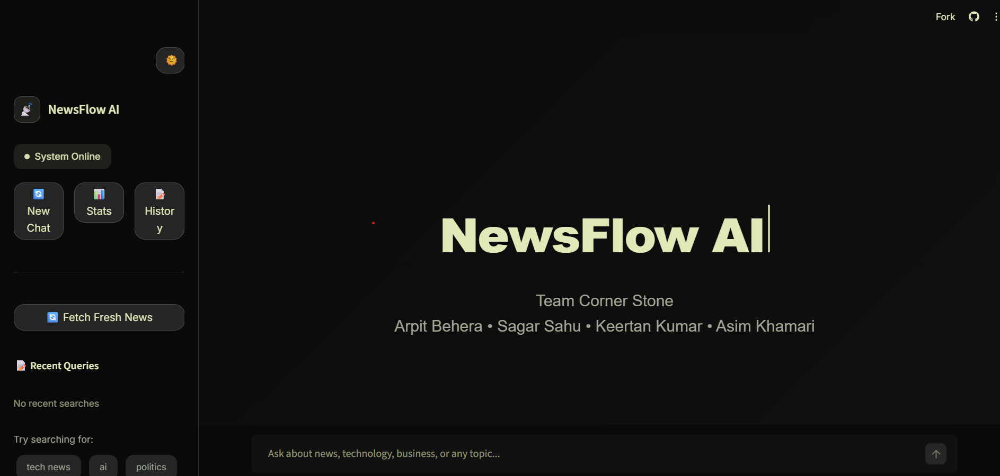

## 📰 NewsFlow AI

**Your real-time AI news assistant.**
Think ChatGPT, but always up to date with *today’s* news.

### 🚀 What It Does

* 🔄 **Live updates** (There are limitations in the cloud storage therefore limited data)
* ⚡ **Instant answers** to breaking news
* 🎯 **Smart filtering** (tech, business, sports, politics, health, more)
* 🧠 **Continuously learning** as news breaks
* 🔐 **Your choice**: Local AI (private) or Cloud AI (powerful)

---

### ✨ Why It’s Special

* **Real-time RAG**: Answers within ~30 seconds of news being published
* **Automatic intent detection**: You ask naturally, it finds the right news
* **Live dashboard**: response time, sources, accuracy, system health

---

### 🛠️ Quick Start (5 Minutes)

```bash
git clone https://github.com/cornerstone-team/newsflow-ai.git
cd newsflow-ai
python -m venv venv
# Activate venv
# Windows:
venv\Scripts\activate
# Mac/Linux:
source venv/bin/activate
pip install -r requirements.txt
```

#### Get API Key

* Get a free key from **newsapi.org**

```bash
cp .env.example .env
```

Edit `.env`:

```env
NEWSAPI_KEY=your_key_here
LLM_BACKEND=cloud
```

#### Run the App

**Terminal 1**

```bash
python simple_news_rag.py
```

**Terminal 2**

```bash
streamlit run app.py
```

Open: `http://localhost:8501`

---

### 🎮 How to Use

Try asking:

* “What’s the biggest news right now?”
* “Latest AI news today”
* “Stock market updates”
* “Sports news from today”

💡 Tip: Use words like *latest* or *today* for freshest results.

---

### 🧠 Local AI (Optional)

```bash
ollama pull mistral
```

Update `.env`:

```env
LLM_BACKEND=local
```

---

### 📊 Dashboard Shows

* Avg response time
* Success rate
* Popular categories
* News sources used

---

### 🐛 Common Fixes

* **Module error** → `pip install -r requirements.txt`
* **API error** → check `NEWSAPI_KEY`
* **No news** → wait 30–60 seconds

---

### 👥 Team Corner Stone

* **Arpit** – System Architect
* **Sagar** – AI Engineer
* **Keertan** – AI/Frontend Engineer
* **Asim** – Data Engineer

---

### ⭐ Support

* Star the repo
* Report issues
* Suggest features
* Share with friends

> *“Finally, an AI that knows what happened this morning.”*
